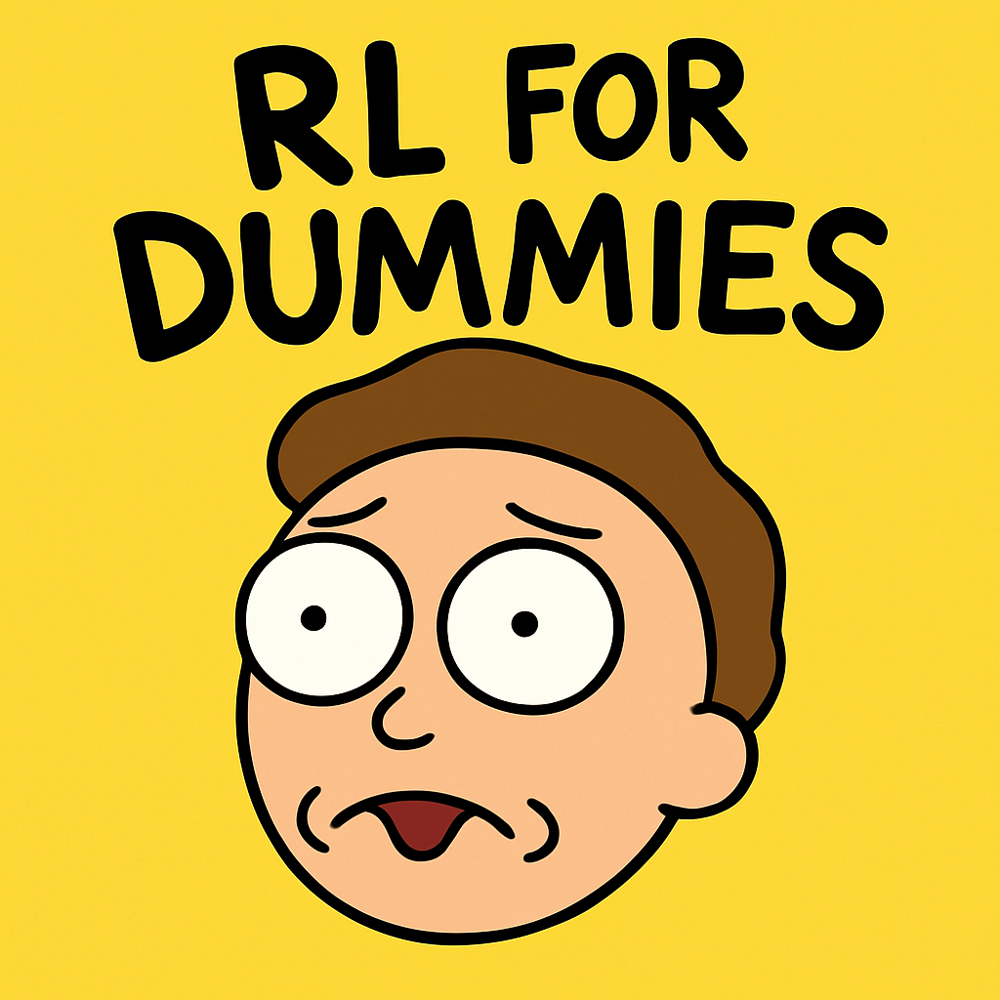

# RL for Dummies

RL code and experiments for simple RL algorithms like REINFORCE, in the style of [CleanRL](https://docs.cleanrl.dev/) and [MinimalRL](https://github.com/seungeunrho/minimalRL).

There are dozens of high-quality deep RL libraries out there, but most of them are not hackable. To understand one algorithm from start to finish requires traversing dozens of classes across dozens of modules. Great for engineering and extensibility, not so great for getting your hands dirty as fast as possible.

Projects like MinimalRL and CleanRL solve this problem wonderfully, but each have some slight shortcomings. MinimalRL implements each algorithm in a single file for either the CartPole or Pendulum environments. This is fine, but a bit _too_ minimal. I still want to be able to track experiments in Tensorboard. I still want to be able to run the algorithms on different environments. CleanRL includes all the bells and whistles, but only implements the canonical deep RL algorithms. I wanted to see simpler algorithms like A2C as well.

### Supported behavior for CleanRL-based environments

- Dynamically load environment and network to use with it
- ...Work on dqn_simple_jax.py first, and then do a sweep of other algorithms and ensure they are all the same.
- We put a focus on Jax (not yet).
