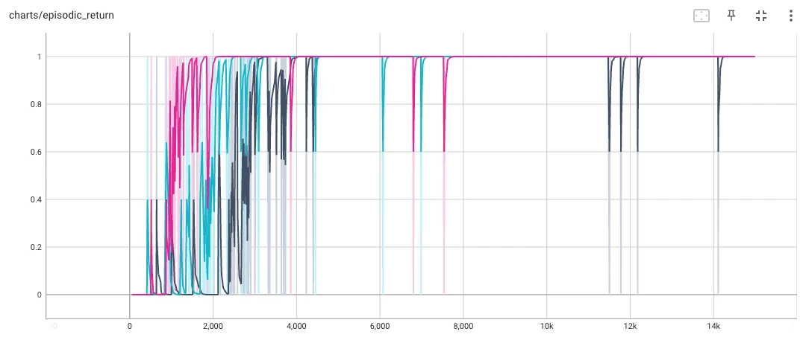
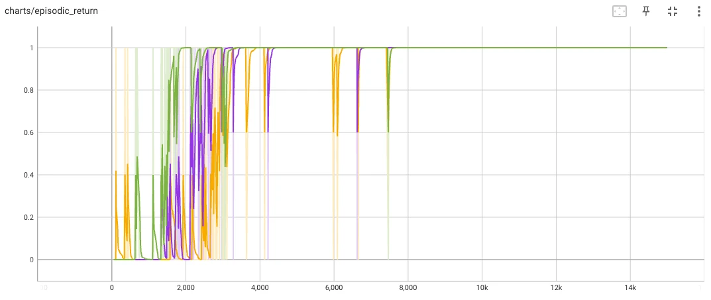
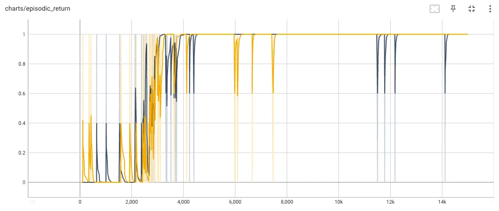
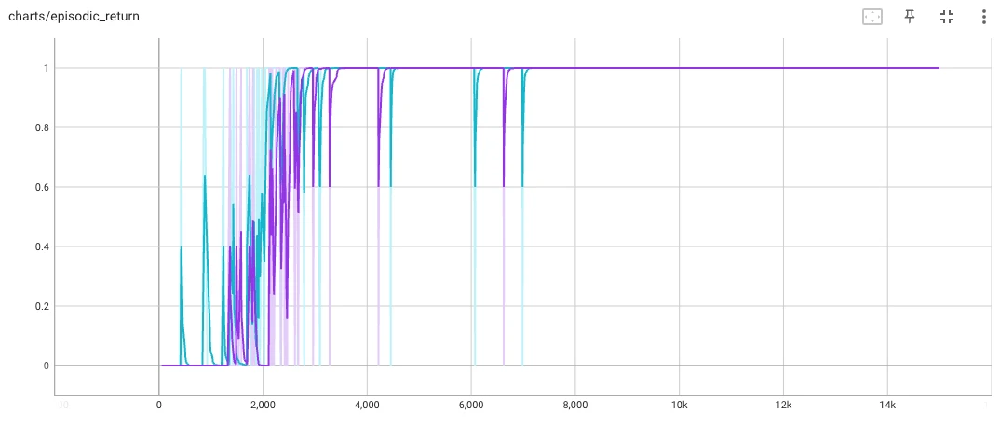
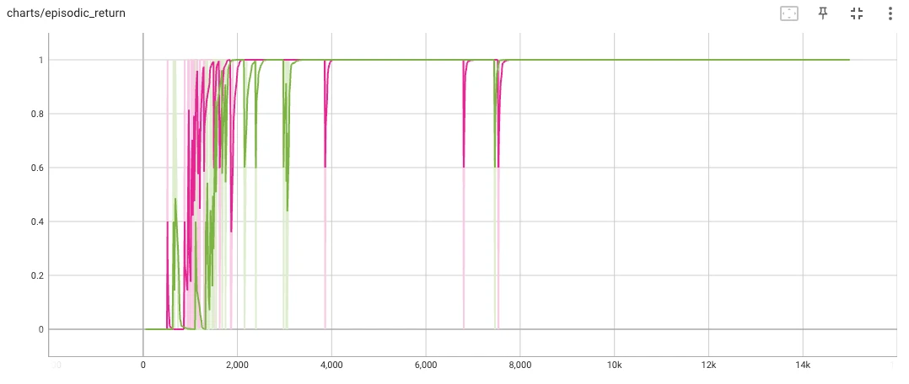

### Question

For single-layer policy networks for REINFORCE on FrozenLake, how does network size affect learning speed? If we keep the number of parameters the same but increase depth, does that change anything?

Below is a sample network:

```python
class Shallow1(nn.Module):
    action_dim: int

    @nn.compact
    def __call__(self, x: jnp.ndarray):
        x = nn.Dense(128)(x)
        x = nn.relu(x)
        logits = nn.Dense(self.action_dim)(x)
        return logits
```

We test the network on FrozenLake for the following networks sizes: 128, 256, 512.

Then we test networks in the following form:

```python
class Deep1(nn.Module):
    action_dim: int

    @nn.compact
    def __call__(self, x: jnp.ndarray):
        x = nn.Dense(45)(x)
        x = nn.relu(x)
        x = nn.Dense(45)(x)
        x = nn.relu(x)
        logits = nn.Dense(self.action_dim)(x)
        return logits
```

Where the number of units in the shallow layers are roughly calculated so that total number of parameters is similar to its shallow version.

$$
16a + a^2 + 4a = 16\,\text{(num shallow units)} + 4\,\text{(num shallow units)}
$$

where $a$ is the number of units in each layer of the deep layer. 16 is the dimension of the input for FrozenLake (one-hot encoded version of the original discrete number input). 4 is the dimension of the action output.

### Run

Train individual networks like this:

```bash
task train -- Shallow1
task train -- Shallow2
task train -- Shallow3
task train -- Deep1
task train -- Deep1
task train -- Deep3
```

Train all networks together:

```bash
task train_all
```

### Results


From left to right, we have Shallow3, Shallow2, and Shallow1. The more units the policy network has in its single layer, the faster it reaches maximum performance.


From left to right, we have Deep3, Deep2, and Deep1. Here we also see that more parameters equals faster learning.


Shallow1(black) versus Deep1(yellow).


Shallow2(turquoise) versus Deep2(purple)


Shallow3(pink) versus Deep3(green)

In general, depth doesn't seem to change much? It's the total number of parameters that matter. Maybe if we test more extreme depths with more than 2 layers, things might change.
